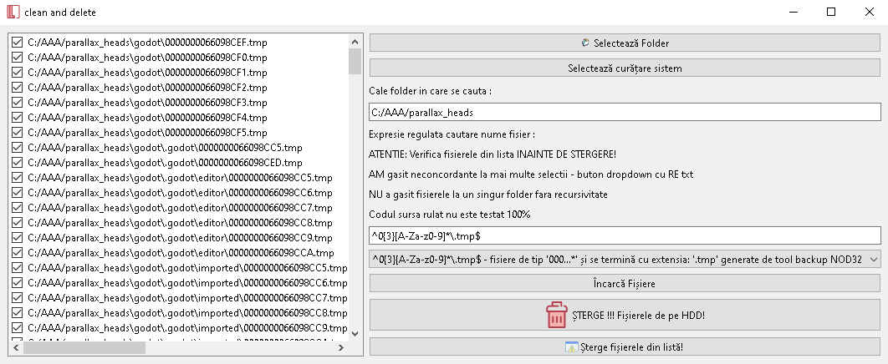

# delete_files_regular_expresion_catafest

This tool will delete files find by an regular expresion catafest usig a PyQt6 

In this example is set for any filename with extension txt, see editbox:   <b><i> .*\.txt </i></b>

How can be used : 

 - you can set a filename using the regular expression
 - use the "Selectează Folder" button to select the folder for delete files
 - use the editbox to select the files name pattern with regular expression:   <b><i> .*\.txt </i></b>
 - use the "Încarcă Fișiere" button to load files into list
 - use the checkbox on each item to select the files for deletion : if is check will be delete if not check will not ...
 - use the "Șterge Fișiere Selectate" button to delete all files show like items in the list
 - use the "Șterge Listă" button to clean the list
 - the "Selectează curățare sistem" will be used in the future to clean the operating system - now not works

:globe_with_meridians: Language ROMANIA 

NOTA:

 Am pastrat avertizarea aceasta :
 
 SyntaxWarning: invalid escape sequence '\.'  template_list = ['^test.*\.py$', '^test.*\.txt$']
 
 Ar fi trebuit să folosim dublul caracter de escape \\ pentru a reprezenta un singur caracter \ pentru a nu avea acesta avertizare
 
 insa nu ar mai fi afisata corect expresia regulata si nu sunt sigur ca ar functiona in toate cazurile mai complexe
 
:globe_with_meridians: Language ENGLISH

NOTE:

  I kept this warning:
  
  SyntaxWarning: invalid escape sequence '\.' template_list = ['^test.*\.py$', '^test.*\.txt$']
  
  We should have used the double escape character \\ to represent a single \ character so it wouldn't have a warning
  
  but the regular expression would no longer be displayed correctly and I am not sure that it would work in all more complex cases
  
